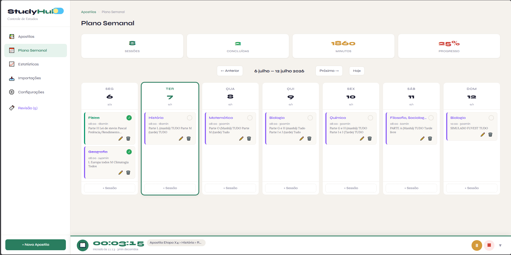
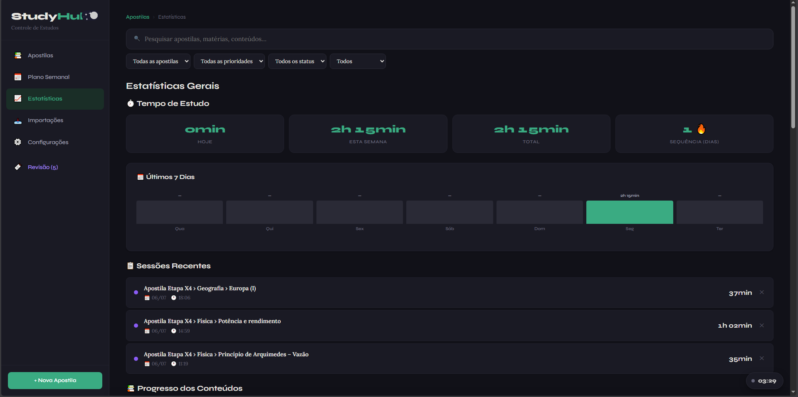
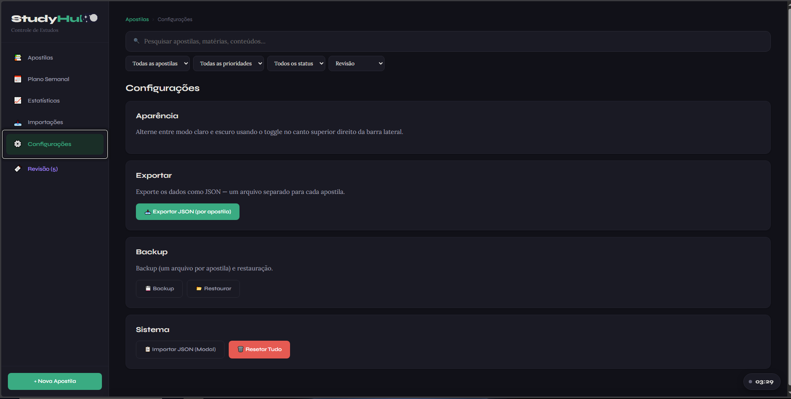

# 📚 StudyHub

**StudyHub** é uma aplicação web single-page, 100% front-end, para organizar seus estudos de ponta a ponta: do planejamento de apostilas e matérias até o acompanhamento do tempo dedicado a cada sessão. Tudo roda direto no navegador, sem servidor e sem necessidade de instalação.

---

## 🖼️ Capturas de Tela

<table>
<tr>
<td width="50%">

**Minhas Apostilas**
 
Visão geral de cada apostila, com progresso de conteúdos e questões.

</td>
<td width="50%">

**Plano Semanal**
 
Organização das sessões de estudo ao longo da semana, com totais de sessões, minutos e progresso.

</td>
</tr>
<tr>
<td width="50%">

**Estatísticas Gerais**
 
Tempo de estudo, sequência de dias, últimos 7 dias e sessões recentes (modo escuro).

</td>
<td width="50%">

**Configurações**
 
Aparência, exportação, backup/restauração e reset dos dados (modo escuro).

</td>
</tr>
</table>

---

## ✨ Funcionalidades

### 🗂️ Organização hierárquica de conteúdo
- **Apostilas** → **Matérias** → **Conteúdos** → **Exercícios**, com cores personalizadas para cada apostila.
- Cada conteúdo possui parte, número da aula, título, status (**pendente**, **estudando**, **concluído**) e observações.
- Marcação de **prioridade** (baixa, média, alta) tanto em matérias quanto em conteúdos individuais.
- Sinalização de conteúdos para **revisão posterior** 🔖, com destaque visual e contagem por matéria.
- Controle de exercícios por conteúdo, com número de questões propostas e resolvidas.

### ⏱️ Timer de estudo integrado
- Barra de cronômetro fixa, com play/pause/stop/reset e opção de minimizar.
- Sessões vinculadas a um conteúdo específico, com rótulo visível durante o estudo.
- Estado do timer persiste no `localStorage`, sobrevivendo a recarregamentos de página.
- Feedback visual animado (pulso) enquanto uma sessão está em andamento.

### 📅 Plano Semanal
- Tela dedicada para organizar sessões de estudo planejadas ao longo da semana.
- Criação e edição de sessões vinculadas a matérias/conteúdos.

### 📊 Estatísticas e gráficos
- Painel com tempo total de estudo, sessões recentes e gráfico dos últimos 7 dias.
- Gráficos de progresso geral (donut) e progresso por matéria/apostila (barras).
- Ranking de apostilas e matérias por desempenho/progresso.

### 🔍 Busca global
- Campo de pesquisa com debounce que varre apostilas, matérias e conteúdos simultaneamente.
- Resultados exibem status, prioridade e sinalizações de revisão, com atalho direto para o conteúdo.

### 🔄 Importação e exportação de dados
- **Importação por texto**: cole um texto estruturado (ex.: `APOSTILA 1`, matérias em maiúsculas, `PARTE L`, `Aula 5: ...`) e o sistema converte automaticamente em apostilas/matérias/conteúdos.
- **Importação/exportação via JSON**, com pré-visualização antes de confirmar.
- **Backup e restauração** completos, gerando um arquivo por apostila.
- Botão de **reset total** dos dados, com confirmação de segurança.

### 🎨 Interface e experiência
- **Modo claro/escuro** com alternância via toggle, preferência salva no `localStorage`.
- Tipografia cuidada (Syne + Lora via Google Fonts) e identidade visual própria.
- Layout responsivo com sidebar de navegação e busca também no mobile.
- Modais reutilizáveis para todas as ações de criação/edição (apostilas, matérias, conteúdos, exercícios, sessões).
- Estados vazios (*empty states*) amigáveis para guiar o primeiro uso.

### 💾 Persistência local
- Todos os dados são armazenados no **`localStorage`** do navegador — não há backend, banco de dados ou envio de informações para servidores externos.

---

## 🚀 Como usar

1. Baixe o arquivo `studyhub_v2.html`.
2. Abra-o em qualquer navegador moderno (Chrome, Firefox, Edge, Safari).
3. Crie sua primeira apostila e comece a organizar suas matérias e conteúdos.
4. (Opcional) Importe dados existentes via texto ou JSON na tela de **Importações**.

> 💡 Como é um arquivo único e estático, também pode ser hospedado facilmente em GitHub Pages, Netlify, Vercel ou qualquer servidor de arquivos estáticos.

---

## 🛠️ Tecnologias

- **HTML5 + CSS3** (variáveis CSS para temas claro/escuro)
- **JavaScript puro (Vanilla JS)** — sem frameworks ou dependências de build
- **Google Fonts** (Syne, Lora)
- **localStorage** para persistência de dados

---

## 📌 Roadmap sugerido

- [ ] Sincronização em nuvem (opcional)
- [ ] Notificações/lembretes de estudo
- [ ] Exportação em PDF dos relatórios de progresso
- [ ] Suporte a múltiplos perfis/usuários

